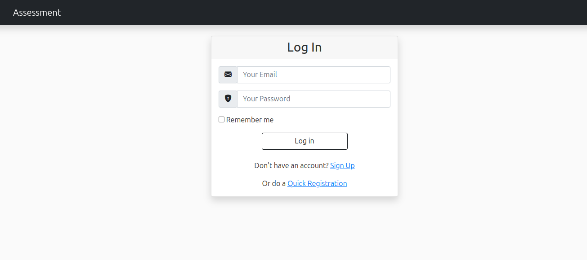
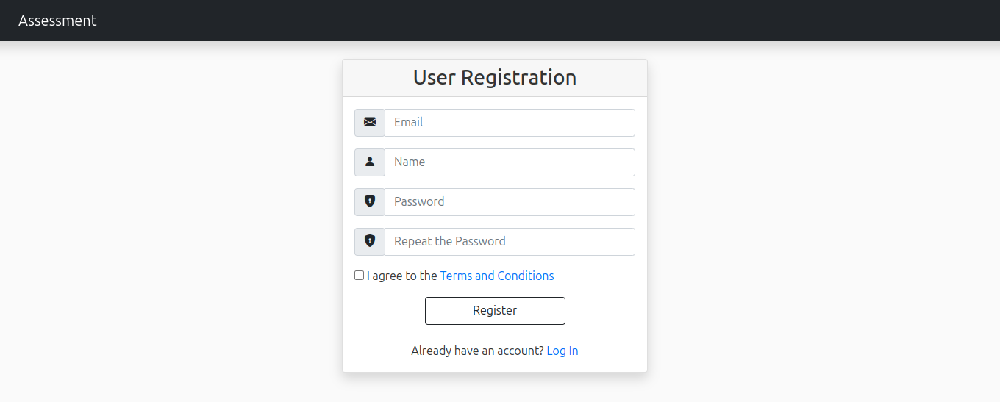
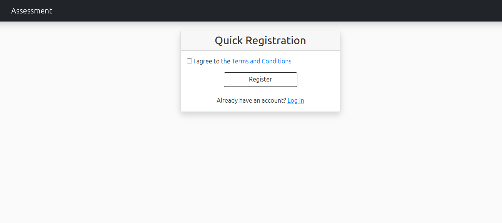
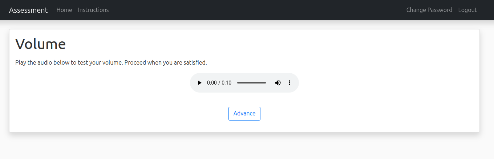
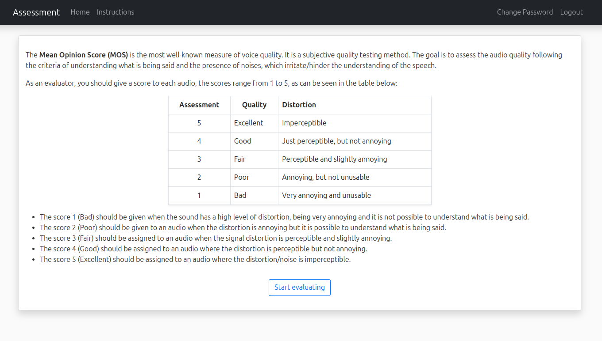
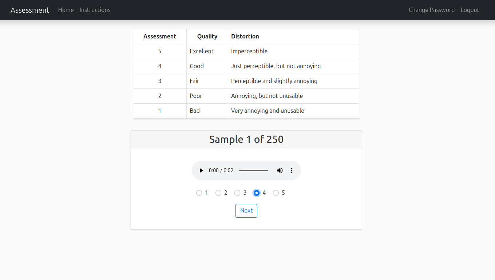

# Quality Evaluation System for Speech Synthesis


- [Introduction](#Introduction)
- [How the Application Works](#How-the-Application-Works)
- [Migration](#Migration)
- [Deployment](#Deployment)
- [Contact](#Contact)

# Introduction

This is a Flask-based web platform designed for the assessment of speech synthesis quality across various languages, leveraging the Mean Opinion Score (MOS) approach.

Supporting multiple languages, including English, Spanish, and Portuguese, the platform dynamically adapts its interface to the user's browser language settings, facilitated by Flask Babel extension.

# How the Application Works

Participants rate each speech sample using a five-point scale: Excellent, Good, Fair, Poor, and Bad, with samples presented sequentially and uniquely to each participant.

To ensure unbiased results, samples are randomized for every participant. Participants can resume their evaluations from where they left off, even after logging out, thanks to session continuity.

## 1. Dependencies

To install the necessary dependencies via pip:

```
$ sudo pip install -r requeriments
```

## 2. Set Environment Variables

To sucessfully run the application you need to set the environment variables that are used to handle encryption and data storage.

These variables can be seen and set in the config file.

The variables that need to be set are:

- SECRET_KEY: The application’s secret key (see Section 3)
- AWS_ACCESS_KEY_ID, AWS_SECRET_ACCESS_KEY, AWS_REGION_NAME: For AWS S3 access
- S3_BUCKET: Name of the Bucket for data to be evaluated
- S3_BUCKET_SOUND_TEST: Name of the Bucket for volume test audio
- S3_KEY_SOUND_TEST: Name of the file for volume testing that is inside the Bucket sount test
- MAX_SAMPLES: Max number of samples for evaluation
- FLASK_CONFIG: Application configuration ('default', 'development', 'production', or 'heroku')

### 2.2 Score Database

The scores given by the users are saved in a RealTime Database on the Firebase platform. Is necessary that you create an account, add a new app project, get the information related to the project and set the enviroment variables that are related with the RealTime Database.

More information can be found [here](https://firebase.google.com).

### 2.3 Audio Database

The audios that will be evaluated need to be stored in a AWS S3 Storage bucket. Set the environment variables related with the S3 storage accordingly.

### 2.4 Volume Test

The audio used as a volume tester also need to be stored in a AWS S3 Storage bucket, in a different bucket from the evaluation data. Set the environment variables accordingly.

## 3. Secret key

Choose your own secret key. As an example, you could use the result from the following script:

```
python -c 'import os; print(os.urandom(24))'
```

## 4. User Information Database

In order to create the database necessary to save the information of your users, run the following bash command:

```
export FLASK_APP=main.py
flask shell
from app import db
db.create_all()
```

## 5. Execute

To run the application, run the following bash command:

```
bash start_app.sh
```

## Migration

In order to migrate your database, run the following bash command:

```
flask db init
flask db migrate -m "your_migration"
```

## Deployment

The application is already prepared to be deployed to Heroku.

More information on deployment using Git can be found [here](https://devcenter.heroku.com/articles/git).

To use Heroku you need to add a Database add-on, I recommend using the "Heroku Postgres" because is easy to use (and cheap 😉)

After adding a database you can execute the commands introduced in Section "4. User Information Database" in bash mode of the console of the application.

# Application

<p align="center"></p>

<p align="center"></p>

<p align="center"></p>

<p align="center"></p>

<p align="center"></p>

<p align="center"></p>

## Author

- Alef Iury Siqueira Ferreira

## Contact

- e-mail: alef_iury_c.c@discente.ufg.br
